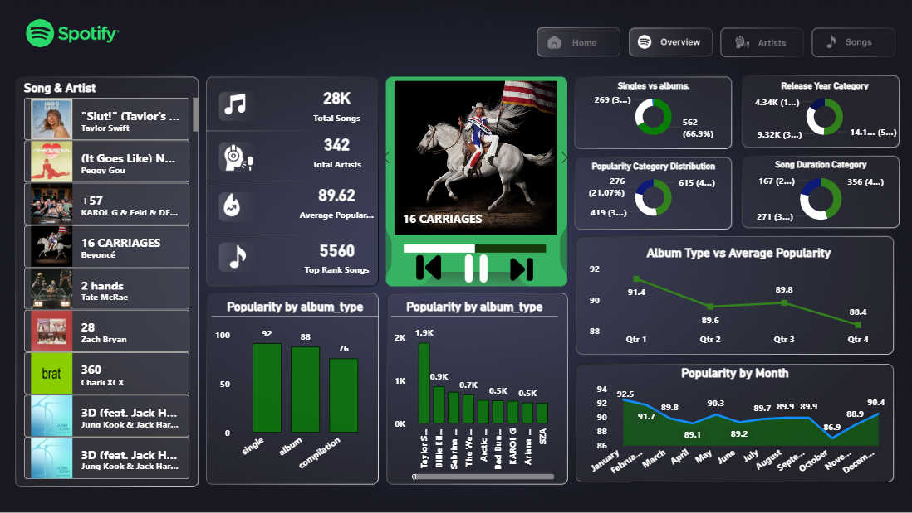

# Spotify Music Dashboard using Power BI

## Project Title
Spotify Music Dashboard | Power BI

## Brief Summary
Developed an interactive Spotify analytics dashboard in Power BI to analyze music trends, artist performance, album insights, and song popularity.

## Overview
This project focuses on transforming Spotify dataset into an interactive dashboard for analyzing:
- Songs
- Artists
- Albums
- Popularity trends
- Music insights

The dashboard includes multiple pages for better navigation and analysis.

## Problem Statement
Music streaming platforms generate huge amounts of data, making it difficult to identify trends and insights directly from raw datasets.

This dashboard helps answer:
- Which songs have the highest popularity?
- Which artists dominate rankings?
- How are albums performing?
- What trends exist across release periods and popularity?

## Dataset
Dataset includes:
- Song Name
- Artist Name
- Album
- Popularity
- Duration
- Release Date
- Album Type
- Explicit Content
- Total Tracks

## Tool Used
- Power BI

## Dashboard Features
- KPI Cards
- Total Songs, Artists, Average Popularity
- Song & Artist Overview
- Popularity Trend Analysis
- Album Type Analysis
- Monthly Popularity Insights
- Interactive Navigation Buttons
- Filters & Slicers

## Key Metrics
- Total Songs: 28K
- Total Artists: 342
- Average Popularity: 89.62
- Top Ranked Songs: 5560

## Key Insights
- Singles outperform albums in popularity
- Popularity trends fluctuate monthly
- A small group of artists dominate rankings
- Album type influences average popularity

## Dashboard Preview

## Results & Conclusion
This project demonstrates how Power BI can transform Spotify music data into interactive dashboards for trend analysis and performance insights.

## Future Improvements
- Genre analysis
- Playlist recommendation insights
- Audio feature analysis

## Author
**Shushree Pranati Swain**

- GitHub: https://github.com/yourusername
- LinkedIn: https://linkedin.com/in/yourprofile
